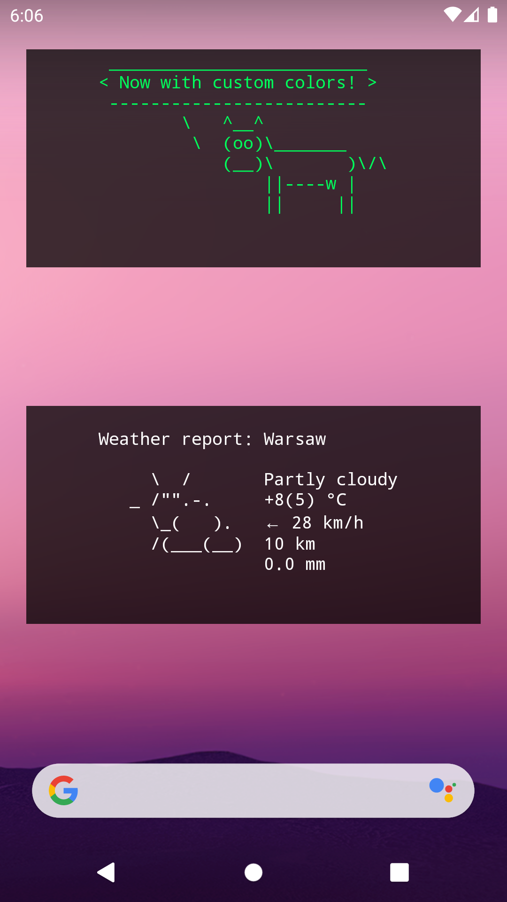

Termux Terminal Widget
======================

Widget that displays output of a shell command.

### [APK Download](https://codeberg.org/gardockt/termux-terminal-widget/releases)

## Requirements
* Android 7.0+
* [Termux](https://github.com/termux/termux-app)

## Limitations
* **No session display, only output:** from my understanding this is impossible to overcome, as running a session is possible only with access to Termux app data - due to Android security system, only Termux can access these files. Other apps from Termux organization, such as Termux:Float, work around this by running as a Termux user, however this can be done only when both Termux and the other app are signed with the same key. The most viable option to make so is to manually compile both Termux and this app - realistically, I don't think anyone is going to do so, and therefore I'm not going to work on this. Note that even without this problem, I cannot guarantee that making a session display is possible.
* **No ANSI escape sequences support:** currently ANSI escape sequences are simply removed out of output text, which may cause it to render poorly. At least some of them are possible to implement (most notably color setting), and support for them may be added in the future.
* **Running service is required:** Android battery optimization limits what an app can do when it's running in background - one thing it can't do is to call a service, which is how commands are run. To work around this, I created a foreground service (which is immune to this optimization), and have widgets run commands through it.
